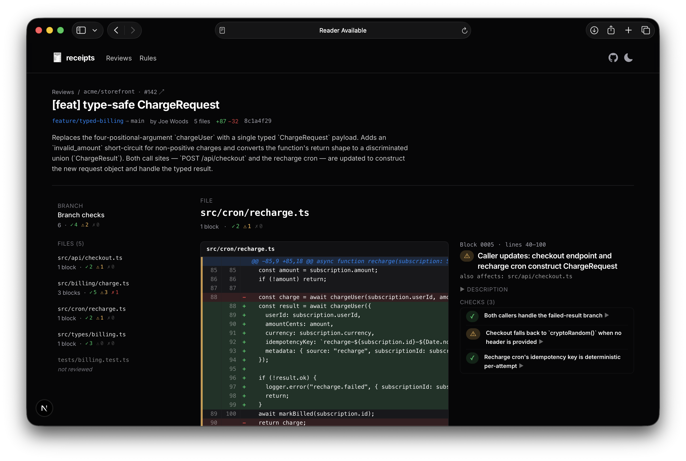
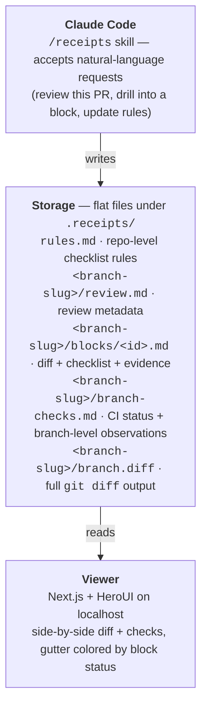

# receipts

> A code review tool for the agentic era. Every diff, with receipts.



LLMs are increasingly involved in generating, refining, and reviewing code. `receipts` codifies the discipline of careful review by turning it into a structured, scannable artifact: for every block of a diff, an agent records what it checked, how it checked, and the evidence — and the result is rendered side-by-side with the diff.

Three pieces:

- **A Claude Code skill** (`/receipts`) that reviews a branch and writes a flat-file evidence ledger.
- **A flat-file store** at `.receipts/<branch-slug>/` in the target repo: review metadata, per-block files with embedded diffs and checks, branch-level checks (including CI status), and the full branch diff.
- **A Next.js + HeroUI viewer** that renders the store as a side-by-side diff + checks UI, with per-block status colors in the diff gutter and hover-to-emphasize.



## Getting started

### 1. Clone and install

```bash
git clone https://github.com/<owner>/receipts.git
cd receipts
npm install
```

### 2. Install the skill

`receipts` ships its skill prompt at `skill/SKILL.md`. Symlink the directory into your Claude Code skills directory so a fresh session can invoke `/receipts`:

```bash
ln -sfn $PWD/skill ~/.claude/skills/receipts
```

Edits to `skill/SKILL.md` propagate immediately — no copy step.

### 3. Run the viewer

By default the viewer reads `.receipts/` from the receipts repo's own working directory:

```bash
npm run dev
# → http://localhost:3000
```

To point it at a real repo's reviews, set `RECEIPTS_DIR`:

```bash
RECEIPTS_DIR=/path/to/your/repo/.receipts npm run dev
```

You can also stash that in `.env.local` (gitignored) so it persists across restarts.

### 4. Review a branch

In Claude Code, with the target repo as your working directory, use natural language. The `/receipts` skill is a *mode*, not a workflow runner — it loads context and accepts requests:

- *"Review this branch."* / *"Do receipts on PR 85."*
- *"What about block 0003?"*
- *"Re-check block 0004."*
- *"Update our rules to always check that DB migrations are reversible."*

The skill writes the review to `.receipts/<branch-slug>/`. Refresh the viewer to see it.

## File store layout

```
.receipts/
  rules.md                        # repo-level rules the agent applies to every block
  <branch-slug>/
    review.md                     # frontmatter (branch, base, SHAs, files list, …) + summary
    branch.diff                   # full `git diff <base>..HEAD` output
    branch-checks.md              # CI status + branch-level observations as ✓/⚠/✗ checks
    blocks/
      0001-<slug>.md              # per-block: title, paths, range, intro, embedded diff, checks
      0002-<slug>.md
      …
    .lock                         # prevents concurrent runs on the same branch
```

A **block** is a coherent line range in a file (or parallel ranges across files for cross-cutting changes). The block IS its lines; checks are commentary on that range. Block status is derived from its checks (worst-wins): any `✗` ⇒ block is `fail`; any `⚠` ⇒ `warn`; otherwise `ok`.

A **check** has a status, a title, a body, and trailers (`Verified-by:`, `Method:`, optional `Source:`). Branch checks use the same shape, including one check per CI job sourced from `gh pr checks <pr>`.

The skill documents adding `.receipts/` to the target repo's `.gitignore` so reviews stay local-only.

## License

MIT.
